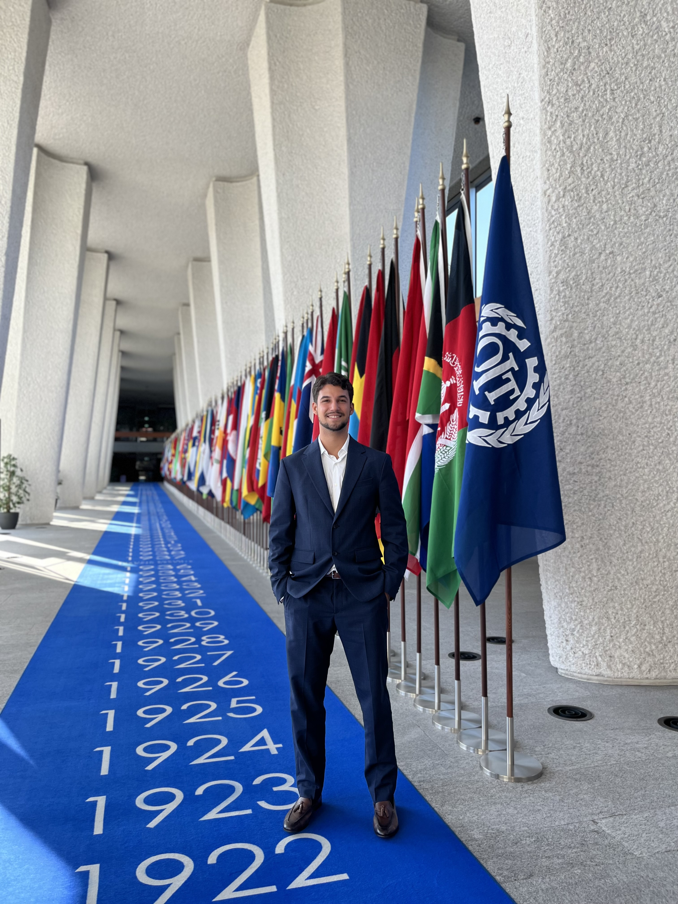

::: {.hero}
::: {.hero-text}
# Enzo Almeida

I am a pre-doctoral fellow at Nova SBE, interested in labour economics, migration and applied microeconomics.

[enzo.almeida@novasbe.pt](mailto:enzo.almeida@novasbe.pt)

[View CV](files/Almeida_CV.pdf){.button}
:::

::: {.hero-photo}
{fig-alt="Portrait of Enzo Almeida"}
:::
:::

## About

My current research work uses administrative microdata to study workers and firms. I am especially interested in how labour market institutions and migration shape workers' outcomes and economic adjustment.

Before joining Nova SBE, I worked as an intern and consultant at the International Labour Organization.

## Research Interests

- Labour economics
- Migration
- Applied microeconomics
